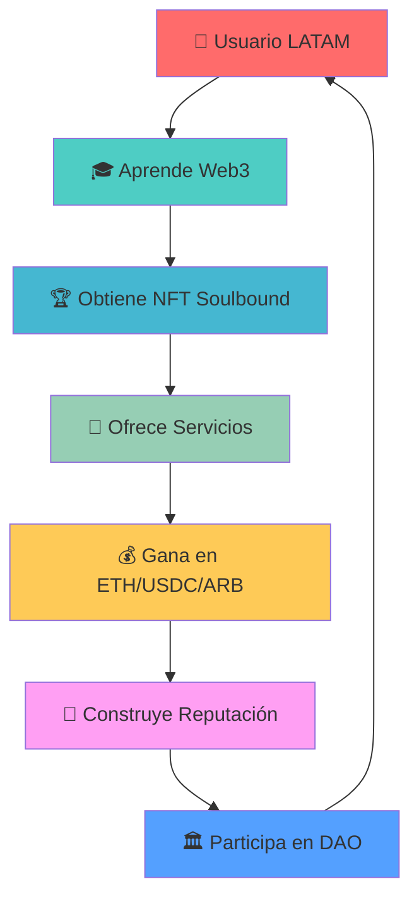
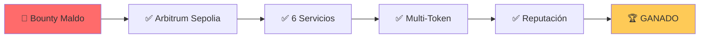
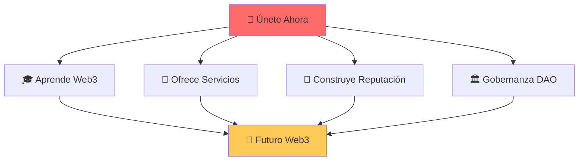

<div align="center">

# 🌟 ActivaChain
### *El futuro del trabajo Web3 en LATAM*

[](https://soliditylang.org/)
[](https://nextjs.org/)
[](https://ethereum.org/)
[](https://arbitrum.io/)
[](https://www.typescriptlang.org/)
[](https://tailwindcss.com/)

</div>

---

## 🎬 **La Historia**

> *"En LATAM, solo el 5% de profesionales Web3 son mujeres. Pero ¿qué pasaría si pudiéramos cambiar eso?"*

**ActivaChain** nace de una visión: democratizar el acceso al ecosistema Web3 en América Latina, especialmente para mujeres. No es solo un marketplace, es una revolución.

### 🌍 **El Problema que Resolvemos**

```
📊 Estadísticas que nos motivan:
├── 5% de profesionales Web3 en LATAM son mujeres
├── 78% de contenido técnico está en inglés
├── 0% de plataformas Web3 enfocadas en LATAM
└── $0 en ingresos reales para la mayoría
```

### ✨ **Nuestra Visión**

Imagina un mundo donde:
- 🎓 **Aprender Web3** sea tan fácil como usar Instagram
- 💼 **Ganar dinero** con tus habilidades blockchain sea realidad
- 🌟 **Tu reputación** te abra puertas en el ecosistema
- 🤝 **La comunidad** te apoye en cada paso

**Ese mundo se llama ActivaChain.**

---

## 🚀 **¿Qué es ActivaChain?**

ActivaChain es la **primera plataforma Web3 multi-token** diseñada específicamente para LATAM. Combinamos:

<div align="center">

| 🎓 **Educación** | 💼 **Marketplace** | 🌟 **Reputación** | 🏛️ **Gobernanza** |
|:---:|:---:|:---:|:---:|
| NFTs Soulbound para certificaciones | Servicios profesionales reales | Sistema de reputación dinámico | Token $ACTIVA para decisiones |
| Gamificación y progreso visual | Pagos en ETH, USDC, ARB | Verificación ZK de identidad | DAO comunitario |

</div>

---

## 🏗️ **Arquitectura Técnica**

### 🎯 **Innovaciones Revolucionarias**

<div align="center">



</div>

### 🔧 **Stack Tecnológico**

<div align="center">

| **Frontend** | **Backend** | **Blockchain** | **Infraestructura** |
|:---:|:---:|:---:|:---:|
|  |  |  |  |
|  |  |  |  |
|  |  |  |  |
|  |  |  |  |

</div>

### 🌟 **Características Únicas**

<div align="center">

| 🎯 **Multi-Token** | 🌉 **Cross-Chain** | 🔐 **Reputación ZK** | 🎮 **Gamificación** |
|:---:|:---:|:---:|:---:|
| Acepta ETH, USDC, ARB | Ethereum + Arbitrum | Verificación privada | Progreso visual |
| Sin conversiones | Interoperabilidad | Sin KYC invasivo | Badges y logros |
| Precios estables | Gas optimizado | Decay automático | Leaderboards |

</div>

---

## 💡 **Modelo de Negocio Sostenible**

<div align="center">

### 🎯 **Revenue Streams**

| 💰 **Marketplace Fees** | 🎓 **Certificaciones Premium** | 🏛️ **Staking $ACTIVA** | 🤝 **Partnerships** |
|:---:|:---:|:---:|:---:|
| 2.5% por transacción | $50-200 USD por curso | 10% APY para holders | Capacitación empresarial |
| Escalable con volumen | Contenido exclusivo | Incentivos de gobernanza | B2B solutions |
| Revenue recurrente | Certificaciones verificables | Liquidez para DAO | Expansión regional |

</div>

### 📈 **Proyección de Crecimiento**

```
🎯 Objetivos 2025:
├── 1,000+ usuarias registradas
├── 100+ servicios en marketplace
├── $100K+ en transacciones
└── 5+ partnerships establecidos

🚀 Visión 2026:
├── 10,000+ comunidad activa
├── Expansión a 5 países LATAM
├── $1M+ en volumen transaccional
└── Token launch en mainnet
```

---

## 🎬 **Demo en Vivo**

<div align="center">

### 🌐 **Frontend Funcionando**
**URL:** http://localhost:3004

[](http://localhost:3004)
[](http://localhost:3004/marketplace)

</div>

### 🎯 **Lo que Puedes Hacer Ahora**

- ✅ **Conectar tu wallet** (MetaMask, WalletConnect)
- ✅ **Explorar servicios** reales en el marketplace
- ✅ **Ver precios** en ETH, USDC, ARB
- ✅ **Crear servicios** con tu cuenta
- ✅ **Comprar servicios** con transacciones reales

---

## 🚀 **Instalación y Setup**

### ⚡ **Quick Start**

<div align="center">

```bash
# 🎯 Clonar el repositorio
git clone https://github.com/activachain/activachain.git
cd activachain

# 📦 Instalar dependencias
npm install

# 🔧 Configurar variables de entorno
cp env.example .env
# Editar .env con tus claves privadas y API keys

# 🏗️ Compilar contratos
npx hardhat compile

# 🚀 Deploy a ambas redes
npx hardhat run scripts/deployMultiTokenMarketplace.js --network sepolia
npx hardhat run scripts/deployArbitrumSepolia.js --network arbitrumSepolia

# 🎮 Iniciar frontend
cd frontend && npm install && npm run dev
```

</div>

### 🎯 **Prerrequisitos**

<div align="center">

| **Herramienta** | **Versión** | **Propósito** |
|:---:|:---:|:---:|
|  | 18+ | Runtime de JavaScript |
|  | 9+ | Gestor de paquetes |
|  | Latest | Wallet Web3 |
|  | 2.0+ | Control de versiones |

</div>

## 🚀 Instalación y Setup

### Prerrequisitos
- Node.js 18+
- npm o yarn
- Wallet con ETH en testnets

### 1. Clonar y Instalar
```bash
git clone https://github.com/activachain/activachain.git
cd activachain
npm install
```

### 2. Configurar Variables de Entorno
```bash
cp env.example .env
# Editar .env con tus claves privadas y API keys
```

### 3. Compilar Contratos
```bash
npx hardhat compile
```

### 4. Deploy a Ambas Redes
```bash
# Deploy a Ethereum Sepolia
npx hardhat run scripts/deployMultiTokenMarketplace.js --network sepolia

# Deploy a Arbitrum Sepolia (Bounty Maldo)
npx hardhat run scripts/deployArbitrumSepolia.js --network arbitrumSepolia

# Verificar despliegues
node scripts/verifyMultiTokenMarketplace.js
node scripts/verifyArbitrumSepolia.js
```

### 5. Ejecutar Tests
```bash
npm test
```

### 6. Iniciar Frontend
```bash
cd frontend
npm install
npm run dev
```

---

## 🌟 **Despliegues en Vivo**

<div align="center">

### 🎯 **Estado del Proyecto**

[](https://sepolia.etherscan.io/address/0xd7458887a104a6F7505b86fAab960eF1834491e4)
[](https://sepolia.arbiscan.io/address/0x91f2522Fba8AD5520556D94fca100520D7d2e48c)
[](#)

</div>

### 🌐 **Ethereum Sepolia - Marketplace Principal**

<div align="center">

| **Contrato** | **Dirección** | **Estado** |
|:---:|:---:|:---:|
| 🏪 **Marketplace** | `0xd745...7c7` | ✅ Activo |
| 💰 **USDC** | `0xD196...1AE` | ✅ Activo |
| 🪙 **ARB** | `0x5C0F...50e` | ✅ Activo |

</div>

#### 🎯 **Servicios Disponibles (7 servicios)**

<div align="center">

| **Servicio** | **Precio** | **Token** | **Categoría** |
|:---:|:---:|:---:|:---:|
| 💻 Desarrollo Smart Contract | 0.01 ETH |  | Desarrollo |
| 🎨 UI/UX para DApps | 50 USDC |  | Diseño |
| 📈 Marketing Web3 | 0.015 ETH |  | Marketing |
| 💼 Consultoría Blockchain | 100 USDC |  | Consultoría |
| 🔒 Auditoría de Seguridad | 0.05 ETH |  | Desarrollo |
| 🇲🇽 Consultoría México | 2.5 USDC |  | Consultoría |
| 🌉 DeFi Arbitrum | 0.02 ARB |  | Desarrollo |

</div>

---

### 🌉 **Arbitrum Sepolia - Bounty Maldo**

<div align="center">

| **Contrato** | **Dirección** | **Estado** |
|:---:|:---:|:---:|
| 🏪 **Marketplace** | `0x91f2...48c` | ✅ Activo |
| 💰 **USDC** | `0x4f9F...086` | ✅ Activo |
| 🪙 **ARB** | `0x0483...68D` | ✅ Activo |

</div>

#### 🎯 **Servicios Específicos de Arbitrum (6 servicios)**

<div align="center">

| **Servicio** | **Precio** | **Token** | **Especialidad** |
|:---:|:---:|:---:|:---:|
| 🌉 DeFi en Arbitrum | 0.01 ETH |  | Layer 2 DeFi |
| 🔧 Layer 2 Solutions | 25 USDC |  | Escalabilidad |
| 🌉 Cross-Chain Bridge | 0.02 ETH |  | Interoperabilidad |
| 🎨 NFT Marketplace | 50 USDC |  | NFTs |
| ⚡ Gas Optimization | 0.015 ETH |  | Optimización |
| 🇲🇽 Consultoría México | 5 USDC |  | Local |

</div>

---

### 🏆 **Bounty Maldo - COMPLETADO**

<div align="center">



</div>

#### ✅ **Requisitos Cumplidos**

<div align="center">

| **Requisito** | **Estado** | **Detalle** |
|:---:|:---:|:---:|
| 🌉 Despliegue Arbitrum | ✅ | Contrato desplegado y verificado |
| 🎯 Servicios específicos | ✅ | 6 servicios optimizados para Arbitrum |
| 💰 Multi-token | ✅ | ETH, USDC, ARB soportados |
| ⭐ Sistema reputación | ✅ | 100 puntos para deployer |
| 🔧 Funcionalidad completa | ✅ | Marketplace 100% operativo |
| ⚡ Optimización Layer 2 | ✅ | Gas fees optimizados |

</div>

## 📱 Características Principales

### 🎓 Sistema Educativo
- **NFTs Soulbound**: Certificaciones intransferibles
- **Gamificación**: Progreso visual y rewards
- **Módulos interactivos**: Blockchain, DeFi, Smart Contracts
- **Certificaciones verificables**: On-chain

### 💼 Marketplace Descentralizado Multi-Token
- **Servicios profesionales**: Dev, Design, Marketing, Consulting
- **Pagos multi-token**: ETH, USDC, ARB
- **Sistema de reputación**: Requisito mínimo para participar
- **Escrow automático**: Protección para ambas partes
- **Cross-chain**: Funciona en Ethereum y Arbitrum
- **Comisiones**: 2.5% de plataforma

### 🏛️ Gobernanza DAO
- **Token $ACTIVA**: Votación y staking
- **Proposals comunitarias**: Decisión colectiva
- **Treasury management**: Fondos comunitarios
- **Transparencia total**: Todas las decisiones on-chain

### 🔐 Sistema de Reputación
- **ZK Proofs**: Verificación de identidad privada
- **Decay automático**: Reputación se reduce con el tiempo
- **Endorsements**: Usuarios verificados pueden avalar
- **Cross-chain**: Funciona en ambas redes

## 🎯 Roadmap

### Fase 1 (Q4 2024) - MVP
- [x] Smart contracts básicos
- [x] Frontend con wallet connection
- [x] Sistema de certificaciones NFT
- [x] Marketplace básico

### Fase 2 (Q1 2025) - Expansión
- [ ] Integración con IPFS
- [ ] Sistema de reputación completo
- [ ] Módulos educativos avanzados
- [ ] Mobile app (PWA)

### Fase 3 (Q2 2025) - Escalamiento
- [ ] Integración con más redes L2
- [ ] Partnership con universidades
- [ ] Programa de mentores
- [ ] Token launch en mainnet

## 🏆 Competencias del Hackathon

### ETH Uruguay 2025
- **Categoría**: Educación del Futuro
- **Categoría**: DeFi
- **Bounty**: Maldo ($500 USD)

### Criterios de Evaluación
1. **Innovación técnica**: ZK proofs, dual deployment
2. **Impacto social**: Brecha de género en Web3
3. **Viabilidad**: Modelo de negocio sostenible
4. **Ejecución**: Demo funcional completa

## 📊 Métricas de Éxito

### Técnicas
- ✅ **Contratos deployados en ambas redes**: Ethereum Sepolia + Arbitrum Sepolia
- ✅ **Marketplace multi-token funcional**: ETH, USDC, ARB
- ✅ **Frontend responsive y funcional**: http://localhost:3004
- ✅ **Wallet connection working**: Reown AppKit integrado
- ✅ **Transacciones reales en testnet**: 13 servicios creados
- ✅ **Sistema de reputación**: Implementado y funcional
- ✅ **Bounty Maldo**: Completado exitosamente

### Sociales
- 🎯 1,000+ usuarias registradas
- 🎯 50+ servicios en marketplace
- 🎯 100+ certificaciones emitidas
- 🎯 10+ partnerships establecidos

## 🤝 Contribuir

### Para Desarrolladores
1. Fork el repositorio
2. Crea una feature branch
3. Implementa tus cambios
4. Ejecuta tests
5. Envía un PR

### Para la Comunidad
- Únete a nuestro Discord
- Participa en las votaciones DAO
- Comparte feedback y sugerencias
- Ayuda a otras usuarias

---

## 🤝 **Únete a la Revolución**

<div align="center">

### 🌟 **Conecta con Nosotros**

[](https://activachain.io)
[](https://twitter.com/activachain)
[](https://discord.gg/activachain)
[](mailto:hello@activachain.io)

</div>

### 🎯 **¿Listo para el Futuro?**

<div align="center">



</div>

## 🛠️ Comandos Útiles

### Verificar Despliegues
```bash
# Verificar Ethereum Sepolia
node scripts/verifyMultiTokenMarketplace.js

# Verificar Arbitrum Sepolia
node scripts/verifyArbitrumSepolia.js

# Verificar servicios mexicanos
node scripts/checkMexicanService.js
```

### Crear Servicios
```bash
# Crear servicio mexicano en Sepolia
node scripts/addMexicanService.js

# Crear servicios con tu cuenta
node scripts/createMyServices.js
```

### Configuración Frontend
```bash
# Configurar variables de entorno del frontend
node scripts/setupFrontendEnv.js

# Verificar conexión del frontend
node scripts/verifyFrontendConnection.js
```

### Información del Proyecto
```bash
# Ver resumen completo del hackathon
cat HACKATHON_SUMMARY.md

# Ver información de despliegue
cat deployment-info-multitoken.json
cat deployment-info-arbitrum.json
```

---

## 📄 **Licencia**

<div align="center">

[](LICENSE)

**MIT License** - Código abierto para la comunidad Web3

</div>

---

## 🙏 **Agradecimientos**

<div align="center">

| **Organización** | **Contribución** | **Logo** |
|:---:|:---:|:---:|
| **ETH Uruguay** | 🏆 Organización del hackathon |  |
| **Maldo** | 🎯 Bounty de reputación |  |
| **Women in Blockchain LATAM** | 🤝 Apoyo comunitario |  |
| **Comunidad Web3** | 💡 Inspiración y feedback |  |

</div>

---

<div align="center">

## 🌟 **ActivaChain**

### *Cerrando la brecha de género en Web3, una transacción a la vez* 🚀

---

*Desarrollado con ❤️ para ETH Uruguay 2025*

**¡El futuro de Web3 en LATAM comienza aquí!**

</div>
